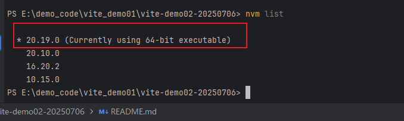
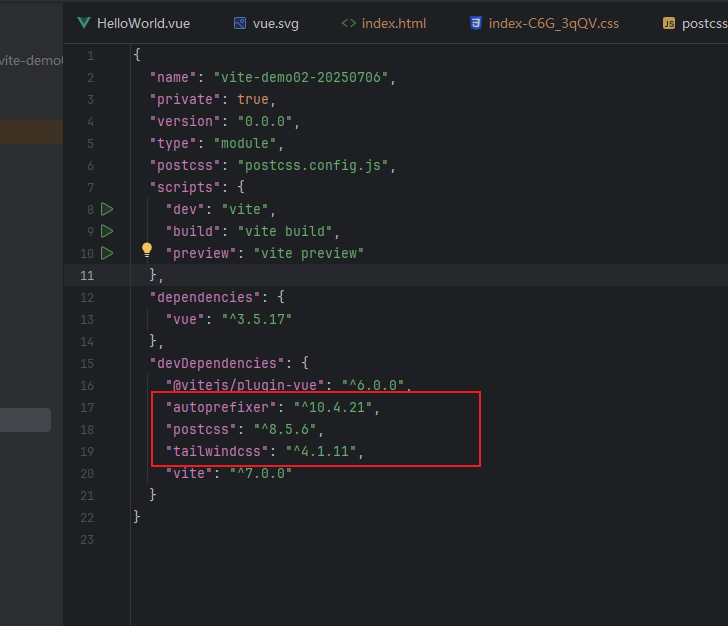
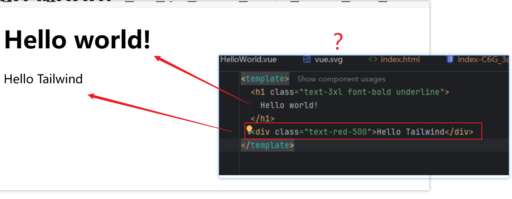

# Vue 3 + Vite

This template should help get you started developing with Vue 3 in Vite. The template uses Vue 3 `<script setup>` SFCs, check out the [script setup docs](https://v3.vuejs.org/api/sfc-script-setup.html#sfc-script-setup) to learn more.

Learn more about IDE Support for Vue in the [Vue Docs Scaling up Guide](https://vuejs.org/guide/scaling-up/tooling.html#ide-support).

# problem

The project tailwindcss created by installing the official documentation link did not take effect. What is the reason for this? Please refer to the readme document for the running effect.

link:[使用 Vite 安装 Tailwind CSS - TailwindCSS 中文文档 | TailwindCSS 中文网 --- Install Tailwind CSS with Vite - TailwindCSS中文文档 | TailwindCSS中文网](https://www.tailwindcss.cn/docs/guides/vite#vue)

why?

# environment

node version

devDependencies

# Operation effect

